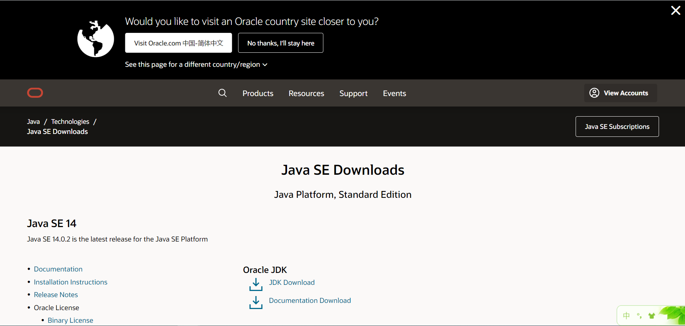
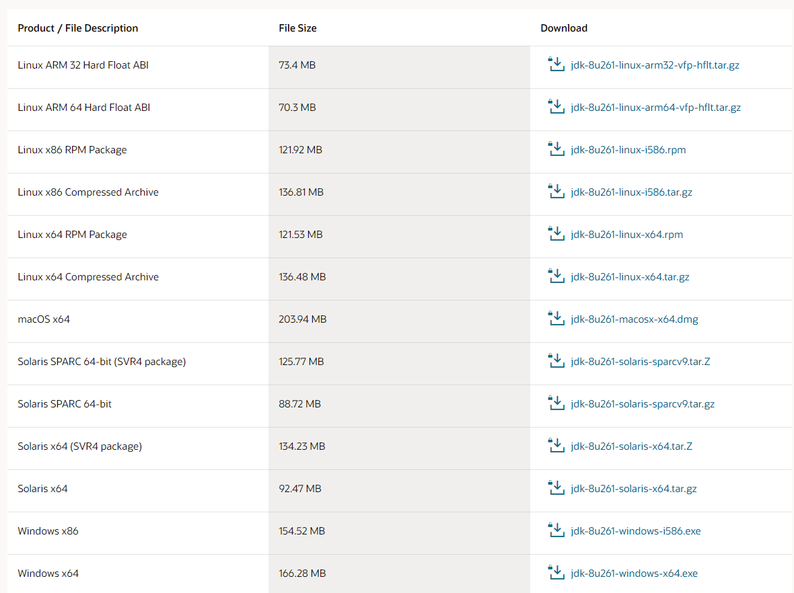
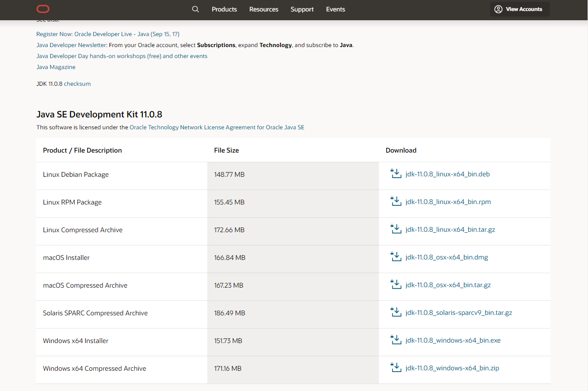
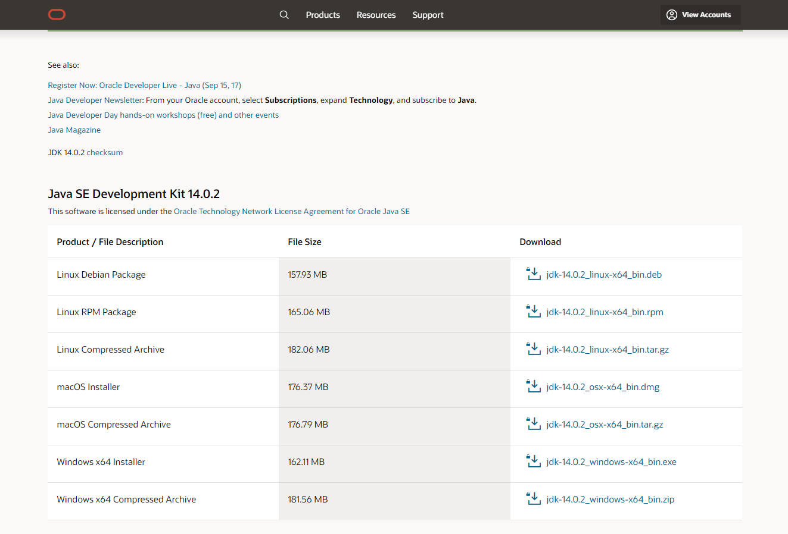

# JAVA & WEB 软件开发（环境搭建）

##  一.工欲善其事必先利其器

1. [JDK各版本下载界面](https://www.oracle.com/java/technologies/javase-downloads.html), 如下图1-1所示。

            图1-1

  > 点击--> [JDK8](https://www.oracle.com/cn/java/technologies/javase/javase-jdk8-downloads.html) 进入下载界面。

 > 点击--> [JDK11](https://www.oracle.com/java/technologies/javase-jdk11-downloads.html) 进入下载界面。

 > 点击--> [JDK14](https://www.oracle.com/java/technologies/javase-jdk14-downloads.html) 进入下载界面。

 >> 推荐下载JDK11(Springboot 初始化采用此版本，发展趋势);
 >> JDK8当前使用开发较多
 >> 下载JDK，可能需要注册oracle账户

